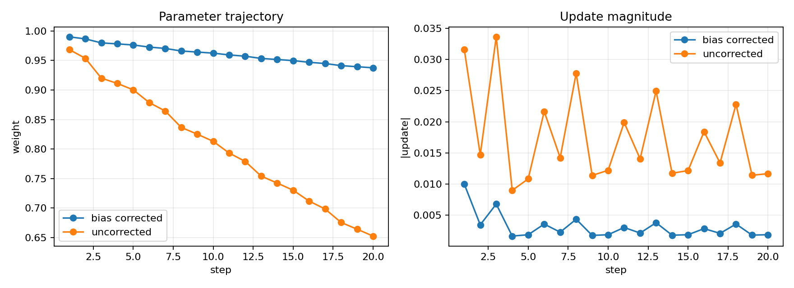
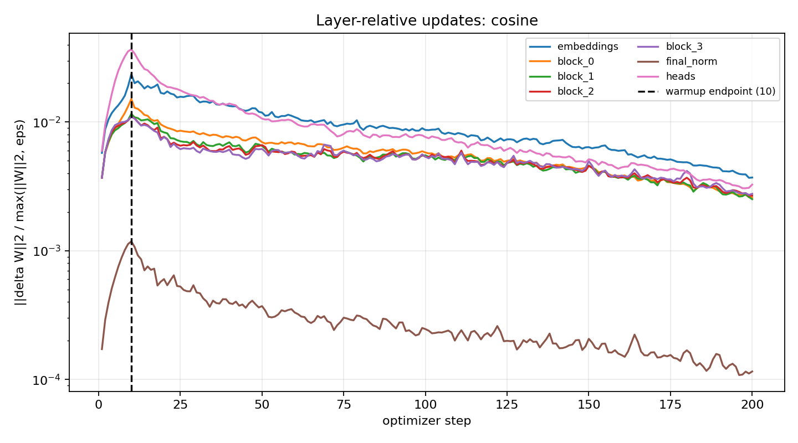
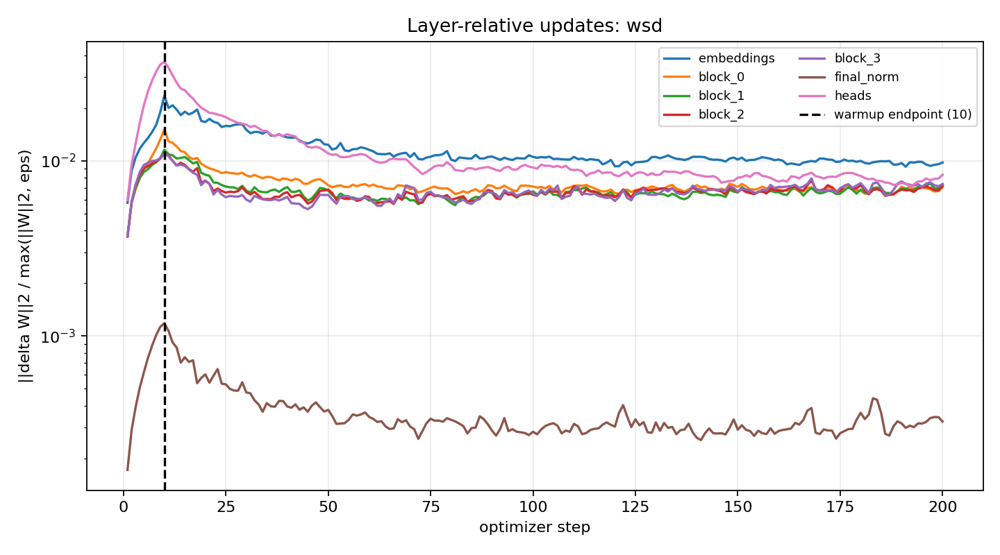
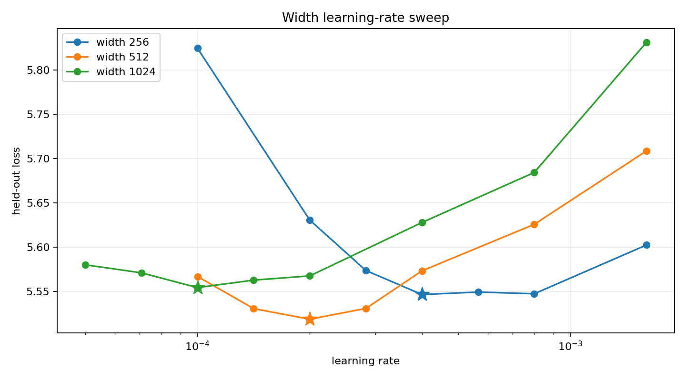

# Transformer optimizer benchmark

This repository answers the optimizer assignment with a four-layer, four-head,
nanoGPT-style character Transformer trained on Tiny Shakespeare. The measured run
used a **Tesla T4**, fp32, fixed model initialization, fixed training batches, fixed
validation batches, and the same tuning budget on both sides of every comparison.

[Executed Colab notebook](results/executed_transformer_optimizer_benchmark_colab.ipynb) ·
[machine-readable metrics](results/metrics.json) ·
[CSV run log](results/run_log.csv) ·
[JSON run log](results/run_log.json) ·
[retained checkpoint](results/retained_model.pt)

## Results at a glance

| Question | Measured answer |
|---|---|
| Does hand-computed Adam match PyTorch? | Yes; maximum absolute discrepancy across `m`, `v`, bias-corrected moments, update, and weight was `1.39e-17`. |
| When does Adam bias correction stop mattering? | Step **3,925**, under the declared `<1%` relative-update difference for 100 consecutive steps rule. |
| When does warmup stop directly changing layer update ratios? | After step **10** for both tuned runs; step 10 reaches the peak LR and step 11 is the first post-warmup update. |
| Cosine or WSD when a 300-step run is stopped at step 200? | Keep **cosine**: held-out loss `5.393769` versus `5.438701` for WSD. |
| Best LR at widths 256 / 512 / 1,024? | `4e-4` / `2e-4` / `1e-4`. |
| LR to try at width 4,096? | **`2.5e-5`**, with moderate model-reported confidence and substantial extrapolation caveats. |

### What the assignment is testing

The Session 11 notes make the expected standard clear. This is not a checklist of
unrelated plots; it is one chain of evidence from a gradient to a defensible
training decision:

1. **Mechanism:** calculate Adam's two state variables, bias corrections, and
   parameter update transparently enough that PyTorch can be used as an independent
   check rather than as the source of the answer.
2. **Early-step behavior:** demonstrate why bias correction and warmup exist, and
   define numerically what “stops mattering” means instead of deciding by eye.
3. **Scale relative to the model:** log `||delta W|| / ||W||` per layer, because an
   absolute update has no meaning without the scale of the weight it moves.
4. **Schedule behavior under interruption:** define both schedules for 300 steps,
   stop them at 200, and compare the resulting checkpoints under controlled data,
   initialization, and tuning. WSD's operational advantage—branching or continuing
   from its stable phase—should be discussed separately from instantaneous loss.
5. **Width transfer:** measure how the best LR moves under standard
   parameterization, mark the empirical minima, extrapolate cautiously, and state
   uncertainty. Implementing muP or Muon is not required by this assignment.
6. **Fairness:** tune both sides with the same search space, seeds, validation data,
   and compute budget before accepting an optimizer or scheduler claim.

## 1. Adam reproduced by hand and checked against PyTorch

The scalar experiment starts from weight \(w_0=1\), uses
\(\alpha=0.01\), \(\beta_1=0.9\), \(\beta_2=0.999\),
\(\epsilon=10^{-8}\), and gradients `[0.25, -0.10, 0.40, -0.30, 0.05]`.
At step \(t\):

\[
m_t=\beta_1m_{t-1}+(1-\beta_1)g_t,\qquad
v_t=\beta_2v_{t-1}+(1-\beta_2)g_t^2
\]

\[
\hat m_t=\frac{m_t}{1-\beta_1^t},\qquad
\hat v_t=\frac{v_t}{1-\beta_2^t},\qquad
\Delta w_t=\alpha\frac{\hat m_t}{\sqrt{\hat v_t}+\epsilon},\qquad
w_t=w_{t-1}-\Delta w_t.
\]

For example, at step 1:

- `m = 0.9(0) + 0.1(0.25) = 0.025000000`
- `v = 0.999(0) + 0.001(0.25²) = 0.000062500`
- `m_hat = 0.025 / (1 - 0.9) = 0.250000000`
- `v_hat = 0.0000625 / (1 - 0.999) = 0.062500000`
- `update = 0.01 × 0.25 / (sqrt(0.0625) + 1e-8) = 0.010000000`
- `new weight = 1.0 - update = 0.990000000`

The remaining four updates repeat exactly the same sequence. Values below are
rounded only for readability; the code retains float64 precision.

### Step 2, using `g = -0.10`

```text
m2     = 0.9(0.025000000) + 0.1(-0.10)          = 0.012500000
v2     = 0.999(0.000062500) + 0.001(-0.10)^2    = 0.000072438
m_hat2 = 0.012500000 / (1 - 0.9^2)               = 0.065789474
v_hat2 = 0.000072438 / (1 - 0.999^2)             = 0.036236868
step2  = 0.01(0.065789474)/(sqrt(0.036236868)+1e-8)
       = 0.003456058
w2     = 0.990000000 - 0.003456058               = 0.986543942
```

### Step 3, using `g = 0.40`

```text
m3     = 0.9(0.012500000) + 0.1(0.40)            = 0.051250000
v3     = 0.999(0.000072438) + 0.001(0.40)^2      = 0.000232365
m_hat3 = 0.051250000 / (1 - 0.9^3)               = 0.189114391
v_hat3 = 0.000232365 / (1 - 0.999^3)             = 0.077532528
step3  = 0.01(0.189114391)/(sqrt(0.077532528)+1e-8)
       = 0.006791764
w3     = 0.986543942 - 0.006791764               = 0.979752178
```

### Step 4, using `g = -0.30`

```text
m4     = 0.9(0.051250000) + 0.1(-0.30)           = 0.016125000
v4     = 0.999(0.000232365) + 0.001(-0.30)^2     = 0.000322133
m_hat4 = 0.016125000 / (1 - 0.9^4)               = 0.046888630
v_hat4 = 0.000322133 / (1 - 0.999^4)             = 0.080654075
step4  = 0.01(0.046888630)/(sqrt(0.080654075)+1e-8)
       = 0.001651028
w4     = 0.979752178 - 0.001651028               = 0.978101150
```

### Step 5, using `g = 0.05`

```text
m5     = 0.9(0.016125000) + 0.1(0.05)            = 0.019512500
v5     = 0.999(0.000322133) + 0.001(0.05)^2      = 0.000324311
m_hat5 = 0.019512500 / (1 - 0.9^5)               = 0.047648409
v_hat5 = 0.000324311 / (1 - 0.999^5)             = 0.064991967
step5  = 0.01(0.047648409)/(sqrt(0.064991967)+1e-8)
       = 0.001869040
w5     = 0.978101150 - 0.001869040               = 0.976232110
```

The complete hand calculation is:

| Step | Gradient | m | v | m-hat | v-hat | Update | New weight |
|---:|---:|---:|---:|---:|---:|---:|---:|
| 1 | 0.250 | 0.025000000 | 0.000062500 | 0.250000000 | 0.062500000 | 0.010000000 | 0.990000000 |
| 2 | -0.100 | 0.012500000 | 0.000072438 | 0.065789474 | 0.036236868 | 0.003456058 | 0.986543942 |
| 3 | 0.400 | 0.051250000 | 0.000232365 | 0.189114391 | 0.077532528 | 0.006791764 | 0.979752178 |
| 4 | -0.300 | 0.016125000 | 0.000322133 | 0.046888630 | 0.080654075 | 0.001651028 | 0.978101150 |
| 5 | 0.050 | 0.019512500 | 0.000324311 | 0.047648409 | 0.064991967 | 0.001869040 | 0.976232110 |

The support code then performs the same five updates with PyTorch float64 Adam,
reads `exp_avg` and `exp_avg_sq` from the optimizer state, reconstructs the two
bias-corrected moments and update, and asserts parity for every row. The largest
absolute error observed locally was `1.39e-17` for `m_hat`; the final weights were
identical at displayed precision. This is substantially tighter than “several
decimal places.”

| Quantity checked against PyTorch | Maximum absolute difference over 5 steps |
|---|---:|
| `m` / PyTorch `exp_avg` | `3.47e-18` |
| `v` / PyTorch `exp_avg_sq` | `0.00` |
| `m_hat` | `1.39e-17` |
| `v_hat` | `0.00` |
| parameter update | `4.34e-19` |
| new weight | `0.00` |

## 2. Adam with bias correction disabled

The same five gradients were repeated cyclically. One trajectory uses the standard
bias-corrected moments; the other substitutes `m` and `v` directly for `m_hat` and
`v_hat`. The first twenty parameter values and update magnitudes are plotted below.
Without correction, Adam takes much larger early steps: at step 1 the update is
`0.031622737` instead of `0.010000000`, and by step 20 the weights are
`0.652596336` and `0.937567500`, respectively.



“Stops mattering” needs a numerical definition. This benchmark declares it to be
the first step beginning **100 consecutive steps** in which
`abs(corrected_update - uncorrected_update) / abs(corrected_update) < 1%`.
Under that rule the answer is **step 3,925**. This long transient is expected here:
`beta2=0.999` makes the second-moment bias decay slowly. A different tolerance or
gradient sequence would produce a different cutoff, so the threshold is part of
the reported result rather than a universal Adam constant.

**Reported cutoff: 3,925 optimizer steps.** At step 3,924 the relative update
difference is still `1.00099%`; at step 3,925 it is `0.99997%`, and it remains
below 1% throughout the required 100-step confirmation window.

## 3. Update-to-weight ratios and the warmup boundary

For every optimizer step and every parameter group, the code snapshots the weights
before `optimizer.step()` and logs

\[
\frac{\lVert\Delta W\rVert_2}{\max(\lVert W\rVert_2,10^{-12})}.
\]

The seven logged groups are `embeddings`, `block_0`, `block_1`, `block_2`,
`block_3`, `final_norm`, and `heads`. Both final runs contain 200 rows for every
group in [results/metrics.json](results/metrics.json). Representative values at
the warmup endpoint and at early stopping are:

| Schedule | Step | Embeddings | Block 0 | Block 1 | Block 2 | Block 3 | Final norm | Heads |
|---|---:|---:|---:|---:|---:|---:|---:|---:|
| Cosine | 10 | 0.0235445 | 0.0151190 | 0.0115782 | 0.0109878 | 0.0109907 | 0.0011835 | 0.0367262 |
| Cosine | 200 | 0.0037079 | 0.0025890 | 0.0025163 | 0.0026825 | 0.0027706 | 0.0001154 | 0.0032676 |
| WSD | 10 | 0.0235445 | 0.0151190 | 0.0115782 | 0.0109878 | 0.0109907 | 0.0011835 | 0.0367262 |
| WSD | 200 | 0.0097825 | 0.0070833 | 0.0073270 | 0.0071637 | 0.0073772 | 0.0003249 | 0.0083316 |

The tuned warmup is **10 steps** for both schedules. Step 10 reaches the peak LR
of `0.0012`; step 11 is the first step for which linear warmup no longer scales the
learning rate. This is therefore the point at which warmup stops *directly*
changing the update-to-weight ratio. The ratios themselves continue to evolve
because the gradients, moments, weights, weight decay, and (for cosine) post-warmup
schedule continue to evolve. The identical curves through step 10 are an additional
control: both final runs use the same initialization, data, optimizer, peak LR, and
warmup, so they diverge only when their schedules diverge.

**Reported warmup boundary: step 10. Warmup stops changing the
update-to-weight ratio beginning at step 11.**

The session notes give roughly `1e-3` as a healthy large-run ratio heuristic. This
short benchmark peaks much higher at the endpoint: `0.0367` for the heads,
`0.0235` for embeddings, and about `0.011–0.015` for the blocks. That does not
change the mechanically observed warmup boundary, but it warns against treating
10 steps and LR `0.0012` as a production recipe. The heads also move about two to
three times more than the blocks, which is exactly the evidence one would use to
decide whether the output head needs its own LR in a longer run.





## 4. Cosine versus WSD, planned for 300 steps and stopped at 200

Each method was independently tuned over the same 12 configurations: peak learning
rates `[1.5e-4, 3e-4, 6e-4, 1.2e-3]` crossed with warmups `[10, 20, 40]`.
Every candidate used the same seed, starting weights, batch order, validation
batches, AdamW settings, model width, and 200-step budget. The best configuration
for each schedule was rerun with per-layer ratio logging.

| Schedule | Tuned peak LR | Warmup | Step-200 train loss | Held-out loss |
|---|---:|---:|---:|---:|
| Cosine | 0.0012 | 10 | 5.283380 | **5.393769** |
| WSD | 0.0012 | 10 | 5.368446 | 5.438701 |

Both schedules were defined over a **300-step horizon** and deliberately stopped
after update **200**. Cosine begins decaying after warmup and would reach 10% of
peak at step 300. WSD is warmup-stable-decay: it remains at peak through step 240,
so stopping at 200 evaluates it before its decay phase.

I would keep the **cosine model** because its held-out loss is lower by `0.044932`
(about `0.83%` relative to WSD), and the retained checkpoint is therefore the
cosine state. Its training loss is also lower by `0.085066`, so there is no
train-versus-validation tradeoff in this observed run. The checkpoint contains
3,233,024 finite parameters, matching the reported model size.

This comparison is fair within the declared grid, but not definitive: both selected
peak learning rates lie at the upper edge of the grid, and the final difference is
from one deterministic seed. Expanding the LR grid and repeating the final
comparison across seeds remain the strongest follow-up checks.

The choice above answers the assignment's loss-based question. The session notes
identify a separate systems advantage for WSD: a checkpoint in its stable phase can
be continued or branched and given a fresh decay later, whereas cosine assumes the
run horizon in advance. If resumability were the primary requirement, WSD could be
the operational choice even though cosine has the lower step-200 loss here.

## 5. Learning-rate sweep across model width

The width sweep used a warmup-stable schedule for 120 steps. It began with learning
rates `[1e-4, 2e-4, 4e-4, 8e-4, 1.6e-3]`, refined interior minima with geometric
midpoints, extended boundary minima when necessary, and repeated the selected
minimum and neighboring rates with seeds 42, 314, and 2718. Stars mark the three
selected minima in the plot.

| Width | Selected LR | Mean held-out loss | Population std. dev. | Boundary minimum? |
|---:|---:|---:|---:|:---:|
| 256 | **0.0004** | 5.546700 | 0.001266 | No |
| 512 | **0.0002** | 5.518814 | 0.006819 | No |
| 1,024 | **0.0001** | 5.554540 | 0.004306 | No |



A log-log fit to the three selected minima gives
`best_lr = exp(-2.278869) × width^-1.000000`, with `R² = 1.0000`. The direct
extrapolation at width 4,096 is therefore **`2.5e-5`**. Seed-wise fits predict a
range from `1.1136e-5` to `2.5e-5`, a `2.24×` spread. The predeclared confidence
rule labels this **moderate confidence** because all aggregate minima are interior,
`R² >= 0.6`, and the seed range is below `4×`.

In practical terms I would use `2.5e-5` as the center of a small 4,096-width sweep,
not as a settled optimum. The apparently perfect fit has only three aggregate
points, the per-seed minima are not stable, and width 4,096 is two doublings beyond
the largest measured model.

### Scientific interpretation and cautions

The measured minima answer the assignment, but several facts matter before treating
`2.5e-5` as a general scaling law:

- **Three points can look deceptively perfect.** `R² = 1.0` is computed from only
  three selected minima. Because those minima halve exactly as width doubles, the
  fitted exponent is exactly `-1`; this is evidence for a hypothesis, not a robust
  estimate of a universal exponent.
- **The LR grid quantizes the answer.** Most tested rates differ by factors of two
  or `sqrt(2)`. A continuous optimum could lie between them, so the exact
  `width^-1` relationship may partly reflect grid resolution.
- **The width-256 minimum is shallow.** Mean held-out loss is `5.546700` at `4e-4`
  and `5.547569` at `8e-4`, a difference of only `0.000869`. That gap is smaller
  than the across-seed variation, so nearby rates are practically tied.
- **Seed agreement is incomplete.** The aggregate minima are interior, but fewer
  than two of the three per-seed optima agree with every aggregate selection. This
  is why the recorded `stable_minima` flag is false.
- **The seeds vary initialization, not batch order.** The sweep deliberately keeps
  the sampled training batches fixed to isolate model initialization. A broader
  claim should also vary data order and report both sources of uncertainty.
- **Candidate replication is adaptive.** The selected LR and nearby candidates
  receive three seeds; distant candidates generally receive one. This is efficient
  for finding a minimum but weaker than a fully replicated grid for estimating the
  entire response curve.
- **Width is not the only scaling variable.** Depth, heads, context length, batch
  size, token budget, optimizer settings, parameterization, and training horizon
  are held fixed here. Changing any of them can change the best LR.
- **The 4,096 result is extrapolated.** It is not a measurement, and it is two
  width doublings beyond 1,024. Memory constraints must not silently change the
  effective batch size; gradient accumulation should preserve it if necessary.
- **Validation noise matters.** Only four fixed validation batches are used. This
  is fair across candidates, but a larger held-out sample is needed for a precise
  ranking.

My practical confidence is therefore **low-to-moderate**, while the benchmark's
predeclared mechanical rule reports **moderate**. I would test width 4,096 at
`[1.25e-5, 1.77e-5, 2.5e-5, 3.54e-5, 5e-5]`, use at least three initialization and
data-order seeds, preserve the effective batch size and token budget, and choose
the rate by mean held-out loss with an uncertainty interval. Until that experiment,
`2.5e-5` is the best center point to try, not a proved optimum.

## 6. Fairness, reproducibility, and audit evidence

The implementation deliberately tunes both sides before choosing a winner. The
cosine and WSD searches receive identical 4-by-3 tuning grids and identical compute
budgets. `train_once()` reseeds before constructing each model; candidate runs use
the same seed and pre-generated batch sequence; validation uses the same four fixed
batches. The only intended difference in the final comparison is the scheduler.

For exact comparability, this benchmark applies AdamW weight decay uniformly to the
model parameters. The full V5 recipe in the session notes recommends excluding
normalization scales and biases. That is a valid production refinement, but it is
not one of the assignment's requested comparisons and changing it after collecting
one side would invalidate the controlled scheduler and width results.

The verified run produced **75 successful timing records** and no failed records.
CUDA was synchronized around every timed component. The full run took **5m 53.3s**
on a Tesla T4 and records every candidate, final run, and width/LR/seed point in the
raw logs. The metrics identify source commit
`ac320c4c9d9b181554746c99301ccdcbf86aa7d5`; the later support-code edits only stop
the experiment pipeline from rewriting the reviewed README and strengthen post-run
validation; they do not change the numerical experiment path.

### Reproduce locally

```bash
python -m pytest -q
MPLCONFIGDIR=/tmp/optimizer-mpl python transformer_optimizer_benchmark.py --profile smoke
```

The smoke profile uses synthetic text on CPU and writes to ignored
`smoke_results/`; it checks orchestration but is not benchmark evidence. The full
profile is intentionally guarded to a CUDA T4 and writes to `results/`. The
[transformer_optimizer_benchmark_colab.ipynb](transformer_optimizer_benchmark_colab.ipynb)
notebook is the clean Colab entry point; the executed reference notebook with
outputs is preserved under `results/`.

## 7. What remains to complete or strengthen the proof

The requested experiments and report are complete. These follow-ups would make the
claims stronger rather than fill a missing artifact:

- [ ] Extend the cosine and WSD peak-LR grid above `1.2e-3` until both optima are
  bracketed by worse candidates; both current winners are at the search boundary.
- [ ] Repeat the tuned cosine-versus-WSD final comparison across at least three
  seeds and report uncertainty on the `0.044932` held-out-loss gap.
- [ ] Measure widths 2,048 and 4,096 near the predicted `2.5e-5` LR to test the
  extrapolated `width^-1` rule directly.
- [ ] Increase the held-out evaluation set beyond four fixed batches to reduce
  validation noise while keeping the same examples for all candidates.
- [ ] If those additional runs change a selected configuration, regenerate the
  plots, metrics, retained checkpoint, and this report together.

### Runnable confirmation suite

The follow-up code is now implemented in
[additional_experiments.py](additional_experiments.py), with a dedicated
[additional Colab notebook](additional_experiments_colab.ipynb). It never changes
the verified `results/` directory. Because the original combined job can exceed a
Colab session's practical 3–4 hour window, the real run is split into seven
independently downloadable parts. The final assembly writes
`results_additional/` and produces:

- an expanded cosine/WSD grid with peak LRs
  `[6e-4, 1.2e-3, 2.4e-3, 4.8e-3]`, warmups `[5, 10, 20, 40]`, and three seeds;
- independently varied initialization and training-data-order seeds, paired fairly
  across schedules and candidates;
- 32 held-out batches per seed instead of four;
- three-seed final losses and mean ± standard-deviation relative-update plots;
- fully replicated five-rate sweeps at widths 2,048 and 4,096;
- a retained checkpoint, metrics, CSV/JSON logs, five plots, and generated
  `SUMMARY.md`;
- explicit LR/warmup bracketing flags and an explicit `resource_limited` result if
  width 4,096 cannot fit, rather than silently changing precision or optimizer.

To verify the workflow cheaply before Colab:

```bash
python additional_experiments.py --smoke
```

To collect the real evidence, run **one row per Colab session**. The estimates are
planning ranges, not measured results; GPU type and Colab load can change them.

| `PART` value | Work in that job | Planning time |
|---|---|---:|
| `scheduler` | 96 tuning runs + 6 final seeded runs | 10–25 min |
| `width_2048` | 5 LRs × 3 seeds | 35–75 min |
| `width_4096_lr_01` | LR `1.25e-5` × 3 seeds | 25–50 min |
| `width_4096_lr_02` | LR `1.767766953e-5` × 3 seeds | 25–50 min |
| `width_4096_lr_03` | LR `2.5e-5` × 3 seeds | 25–50 min |
| `width_4096_lr_04` | LR `3.535533906e-5` × 3 seeds | 25–50 min |
| `width_4096_lr_05` | LR `5e-5` × 3 seeds | 25–50 min |

The total compute is intentionally unchanged—the scientific comparison still has
the same rates, seeds, batches, and steps—but no single width-4,096 job contains
more than three training runs.

For each row:

1. Push the latest `colab-results` branch.
2. Open `additional_experiments_colab.ipynb` in Colab and select a GPU runtime.
   More than 16 GiB is preferred. Width 4,096 has 806,703,104 parameters and an
   estimated 12.02 GiB of persistent fp32 AdamW parameter/gradient/moment state
   before activations and temporary buffers.
3. Set the notebook's `PART` value to the row being run and run all cells. At
   width 4,096 the runner preserves effective batch 8 using
   micro-batch 1 and eight accumulation steps, divides each micro-batch loss by the
   accumulation count, enables activation checkpointing, and disables AdamW's
   parameter-sized foreach temporaries.
4. The last cell validates and immediately downloads `<PART>.zip`.
5. Extract every zip at the repository root. Each contains exactly
   `results_additional_parts/<PART>/`; do not rename these directories and do not
   replace the verified `results/` folder.

After all seven directories have been returned, assemble them locally without any
training:

```bash
python additional_experiments.py --assemble
```

The assembler refuses missing parts, source-commit or plan mismatches, conflicting
duplicate observations, and dataset-hash mismatches. It recomputes the two
large-width minima over the complete grids, creates all five charts, copies the
retained scheduler checkpoint, and writes the combined metrics and logs to
`results_additional/`.

After the folder is returned, rerun `python -m pytest -q`, review
`results_additional/SUMMARY.md`, compare every selected minimum with its neighboring
points and seed variation, then update the conclusions only if the added evidence
supports the change.

## Repository contents

- [transformer_optimizer_benchmark.py](transformer_optimizer_benchmark.py): model,
  hand Adam calculation, PyTorch reference, schedulers, tuning, width sweep,
  per-layer logging, validation, and plotting.
- [tests/test_transformer_optimizer_benchmark.py](tests/test_transformer_optimizer_benchmark.py):
  arithmetic parity, schedule boundaries, ratio aggregation, deterministic batches,
  timing schema, and full-result gating.
- [transformer_optimizer_benchmark_colab.ipynb](transformer_optimizer_benchmark_colab.ipynb):
  reproducible T4 workflow without credentials or repository mutation.
- [additional_experiments.py](additional_experiments.py): expanded multi-seed
  scheduler and large-width confirmation runner, split-job definitions, and
  zero-training assembler.
- [additional_experiments_colab.ipynb](additional_experiments_colab.ipynb): isolated
  Colab workflow that validates and downloads one selected part at a time.
- [results/](results): metrics, complete logs, four plots, executed notebook,
  run provenance, and the retained cosine checkpoint.
